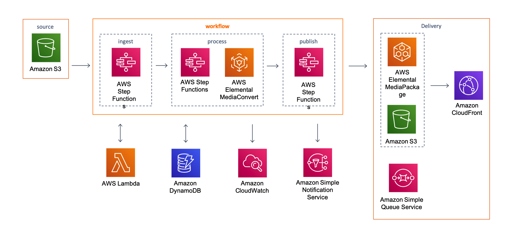

# Dolby Vision on AWS

How to implement a dolby-vision workflow on AWS leveraging AWS Step Functions, AWS Elemental MediaConvert, and AWS Elemental MediaPackage.

## On this Page
- [Architecture Overview](#architecture-overview)
- [Deployment](#deployment)
- [Workflow Configuration](#workflow-configuration)
- [Source Metadata Option](#source-metadata-option)
- [Encoding Templates](#encoding-templates)
- [Accelerated Transcoding](#accelerated-transcoding)
- [Source Code](#source-code)
- [Creating a custom Build](#creating-a-custom-build)
- [Additional Resources](#additional-resources)

## Architecture Overview


## Deployment
The solution is deployed using a CloudFormation template with a lambda backed custom resource.

> **Please ensure you test the new template before updating any production deployments.**

## Workflow Configuration
The workflow configuration is set at deployment and is defined as environment variables for the input-validate lambda function (which is the first step in the ingest process).

#### Environment Variables:
* **CloudFront:**	CloudFront domain name, used to generate the playback URLs for the MediaConvert outputs
* **Destination:**	The name of the destination S3 bucket for all of the MediaConvert outputs
* **Source:**	The name of the source S3 bucket
* **JobsBucket:**   The name of the S3 bucket for input job metadata files
* **Templates:**   The name of the S3 bucket for custom encoding templates
* **WorkflowName:**	Used to tag all of the MediaConvert encoding jobs
* **AcceleratedTranscoding** Enabled Accelerated Transocding in MediaConvert. options include ENABLE, DISABLE, PREFERRED. for more detials please see: 
* **EnableSns** Send SNS notifications for the workflow results.
* **EnableSqs** Send the workflow results to an SQS queue

### WorkFlow Triggers

#### Source Metadata
The stack is deployed with the workflow trigger parameter set to MetadataFile; therefore the S3 notification is configured to trigger the workflow whenever a JSON file is uploaded. This allows different workflow configuration to be defined for each source video processed by the workflow.

> **Important:** The source video file and/or custom templates must be uploaded to S3 before the metadata file is uploaded, and the metadata file must be valid JSON with a .json file extension.

**Example JSON job metadata file (with default template):**
```
{
    "srcVideo": "SolLevante_IMF_DolbyVision_PQP3D65_UHD_24fps/VIDEO_e4da5fcd-5ffc-4713-bcdd-95ea579d790b.mxf",
    "jobTemplate": {
        "type": "default",
        "name": "dolby-vision-on-aws-default-template-cmaf-dvp5-24fps"
    }
}
```

**Example JSON job metadata file (with custom template):**
```
{
    "srcVideo": "SolLevante_IMF_DolbyVision_PQP3D65_UHD_24fps/VIDEO_e4da5fcd-5ffc-4713-bcdd-95ea579d790b.mxf",
    "jobTemplate": {
        "type": "custom",
        "name": "custom-job-24fps-mp4_2160p_1080p-full-template.json"
    }
}
```

Required fields for the metadata file are **srcVideo**, **jobTemplate**, **name** and **type**. The workflow will default to the environment variables settings for the ingest validate lambda function for any settings not defined in the metadata file.

**Full list of options:**
```
{
    "srcVideo": "string",
    "srcBucket": "string",
    "destBucket": "string",
    "cloudFront": "string"
}
```

> **Sample job metadata files are found in the test folder.** 

The solution also supports adding additional metadata, such as title, genre, or any other information, you want to store in Amazon DynamoDB.

## Encoding Templates
At launch the Solution creates 10 MediaConvert job templates which are used as the default encoding templates for the workflow:
- **default-template-cmaf-dvp5-24fps**
- **default-template-cmaf-dvp5-25fps**
- **default-template-cmaf-dvp5-30fps**
- **default-template-cmaf-dvp5-50fps**
- **default-template-cmaf-dvp5-60fps**
- **default-template-mp4-dvp5-24fps**
- **default-template-mp4-dvp5-25fps**
- **default-template-mp4-dvp5-30fps**
- **default-template-mp4-dvp5-50fps**
- **default-template-mp4-dvp5-60fps**

Custom encoding templates can be also created by the user and located in the S3 bucket "Templates".

The type and name of the template to be used are specified in the job metadata file by the user. If custom encoding template is chosen, it checks the S3 bucket for Templates, gets the user-given encoding template json, then submits a job to Elemental MediaConvert. If default template is chosen, the job is submitted with one of the default encoding templates described above.


> **Sample custom encoding templates are found in the test folder.** 

## Accelerated Transcoding 
(This option is not tested with Dolby Vision encoding job. Therefore, it is set to DISABLED by default.)

Version 5.1.0 introduces support for accelerated transcoding which is a pro tier feature of AWS Elemental MediaConvert. This feature can be configured when launching the template with one of the following options:

* **ENABLED** All files upload will have acceleration enabled. Files that are not supported will not be processed and the workflow will fail
* **PREFERRED** All files uploaded will be processed but only supported files will have acceleration enabled, the workflow will not fail.
* **DISABLED** No acceleration.

For more detail please see [Accelerated Transcoding](https://docs.aws.amazon.com/mediaconvert/latest/ug/accelerated-transcoding.html).

## Source code

### Node.js 12
* **archive-source:** Lambda function to tag the source video in s3 to enable the Glacier lifecycle policy.
* **custom-resource:** Lambda backed CloudFormation custom resource to deploy MediaConvert templates configure S3 event notifications.
* **dynamo:** Lambda function to Update DynamoDB.
* **encode:** Lambda function to submit an encoding job to Elemental MediaConvert.
* **error-handler:** Lambda function to handler any errors created by the workflow or MediaConvert.
* **input-validate:** Lambda function to parse S3 event notifications and define the workflow parameters.
* **media-package-assets:** Lambda function to ingest an asset into MediaPackage-VOD.
* **output-validate:** Lambda function to parse MediaConvert CloudWatch Events.
* **profiler:** Lambda function used to send publish and/or error notifications.
* **step-functions:** Lambda function to trigger AWS Step Functions.

### Python 3.7
* **mediainfo:** Lambda function to run [mediainfo](https://mediaarea.net/en/MediaInfo) on an S3 signed url.

> ./source/mediainfo/bin/mediainfo must be made executable before deploying to lambda.

## Creating a custom build
The solution can be deployed through the CloudFormation template available on the solution home page: [Video on Demand on AWS](https://aws.amazon.com/answers/media-entertainment/video-on-demand-on-aws/).
To make changes to the solution, download or clone this repo, update the source code and then run the deployment/build-s3-dist.sh script to deploy the updated Lambda code to an Amazon S3 bucket in your account.

### Prerequisites:
* [AWS Command Line Interface](https://aws.amazon.com/cli/)
* Node.js 12.x or later
* Python 3.8 or later

### 1. Running unit tests for customization
Run unit tests to make sure added customization passes the tests:
```
cd ./deployment
chmod +x ./run-unit-tests.sh
./run-unit-tests.sh
```

### 2. Create an Amazon S3 Bucket
The CloudFormation template is configured to pull the Lambda deployment packages from Amazon S3 bucket in the region the template is being launched in. Create a bucket in the desired region with the region name appended to the name of the bucket (e.g. for us-east-1 create a bucket named ```my-bucket-us-east-1```).
```
aws s3 mb s3://my-bucket-us-east-1
```

### 3. Create the deployment packages
Build the distributable:
```
chmod +x ./build-s3-dist.sh
./build-s3-dist.sh my-bucket dolby-vision-on-aws version
```

> **Notes**: The _build-s3-dist_ script expects the bucket name as one of its parameters, and this value should not include the region suffix.

Deploy the distributable to the Amazon S3 bucket in your account:
```
aws s3 cp ./regional-s3-assets/ s3://my-bucket-us-east-1/dolby-vision-on-aws/version/ --recursive --acl bucket-owner-full-control
```

### 4. Launch the CloudFormation template.
* Get the link of the dolby-vision-on-aws.template uploaded to your Amazon S3 bucket.
* Deploy the Video on Demand to your account by launching a new AWS CloudFormation stack using the link of the dolby-vision-on-aws.template.

## Additional Resources

### Services
- [AWS Elemental MediaConvert](https://aws.amazon.com/mediaconvert/)
- [AWS Elemental MediaPackage](https://aws.amazon.com/mediapackage/)
- [AWS Step Functions](https://aws.amazon.com/step-functions/)
- [AWS Lambda](https://aws.amazon.com/lambda/)
- [Amazon CloudFront](https://aws.amazon.com/cloudfront/)
- [OTT Workflows](https://www.elemental.com/applications/ott-workflows)
- [QVBR and MediaConvert](https://docs.aws.amazon.com/mediaconvert/latest/ug/cbr-vbr-qvbr.html)

### Other Solutions and Demos
- [Live Streaming On AWS](https://aws.amazon.com/solutions/live-streaming-on-aws/)
- [Media Analysis Solution](https://aws.amazon.com/solutions/media-analysis-solution/)
- [Live Streaming and Live to VOD Workshop](https://github.com/awslabs/speke-reference-server)
- [Live to VOD with Machine Learning](https://github.com/aws-samples/aws-elemental-instant-video-highlights)
- [Demo SPEKE Reference Server](https://github.com/awslabs/speke-reference-server)

***

Copyright 2020 Amazon.com, Inc. or its affiliates. All Rights Reserved.

Licensed under the Apache License, Version 2.0 (the "License");
you may not use this file except in compliance with the License.
You may obtain a copy of the License at

    http://www.apache.org/licenses/LICENSE-2.0

Unless required by applicable law or agreed to in writing, software
distributed under the License is distributed on an "AS IS" BASIS,
WITHOUT WARRANTIES OR CONDITIONS OF ANY KIND, either express or implied.
See the License for the specific language governing permissions and
limitations under the License.
